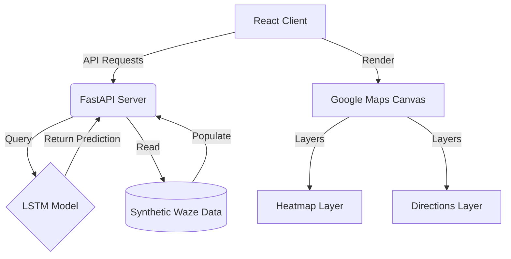

# 🚦 TrafficSense AI - Advanced Traffic Intelligence

## 📝 Project Description
TrafficSense AI is a state-of-the-art **Intelligent Traffic Prediction and Management System** tailored for the Pune Metropolitan Region. The platform leverages Deep Learning (LSTM Networks) and real-time simulation to help commuters find the fastest routes, visualize city-wide congestion heatmaps, and receive proactive traffic alerts.

## ⚠️ Problem Statement
Pune faces severe traffic congestion due to rapid urbanization, increasing vehicular density, and unpredictable road incidents. Traditional navigation systems often treat traffic as a static variable, failing to account for the temporal patterns and specific hotspots that define daily commutes in areas like Hinjewadi and Baner.

## ✅ Solution
TrafficSense AI provides a data-driven approach to city mobility. By training on historical traffic severity data, the system predicts upcoming congestion waves and offers a "Smart Route" planner that dynamically avoids heavy traffic. Feature-rich dashboards provide visual clarity through heatmaps and real-time hotspot lists, enabling better decision-making for both drivers and urban planners.

## 🛠️ Tech Stack
| Component | Technology |
| :--- | :--- |
| **Frontend** | React, Vite, Framer Motion, Recharts |
| **Backend** | FastAPI, Uvicorn, Python-Dotenv |
| **Mapping** | Google Maps API (Directions, Geometry, Visualization) |
| **AI/ML** | TensorFlow/Keras, Pandas, NumPy, Scikit-Learn |
| **Design** | Lucide Icons, Modern HSL neon aesthetic |

## 🏗️ Architecture Diagram


## ✨ Features
- **Smart Route AI Planner**: Point-to-point routing with Uber/Ola style vehicle animation along the fastest, least-congested path.
- **Traffic Heatmaps**: City-wide congestion density visualization using Google Maps Visualization library.
- **AI Prediction Engine**: Forecasts traffic severity based on temporal sequences.
- **Live Traffic Hotspots**: Instant lookup for critical congestion zones (e.g., MG Road, Katraj).
- **Traffic Forecast Timeline**: 12-hour futuristic outlook on city speed trends.
- **Interactive Analytics**: Hourly trend charts and historical speed distribution.


## ⚙️ Installation Steps
1. **Clone the Project**:
   ```bash
   git clone https://github.com/Shrushti-cse1111/TrafficSense-AI
   cd TrafficSense-AI
   ```
2. **Setup Backend**:
   ```bash
   pip install -r requirements.txt
   # Create .env from .env.example
   ```
3. **Setup Frontend**:
   ```bash
   cd web
   npm install
   # Create .env from .env.example
   ```

## 🚀 How to Run the Project
1. **Launch API**:
   ```bash
   cd api
   python main.py
   ```
2. **Launch Web App**:
   ```bash
   cd web
   npm run dev
   ```

## 🔮 Future Improvements
See the full roadmap in [FUTURE_IMPROVEMENTS.md](./FUTURE_IMPROVEMENTS.md).
- Integration with live city traffic APIs.
- Mobile companion application.
- Public transport (PMPML) optimization.

## ✍️ Author
- **Shrushti** - *Lead Developer*
